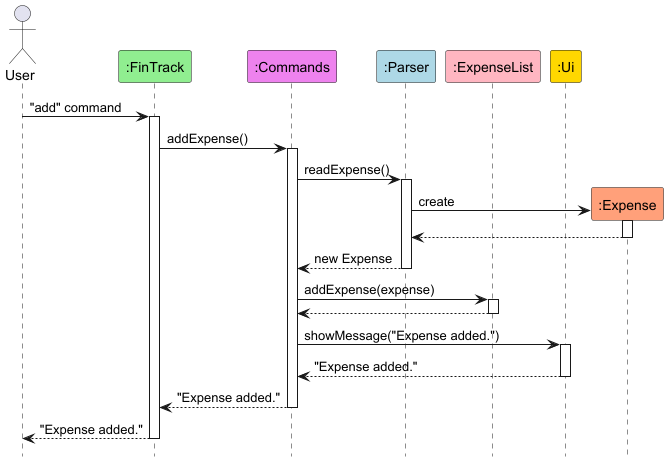
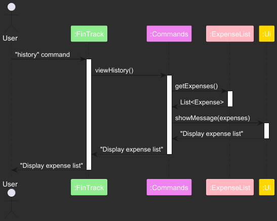
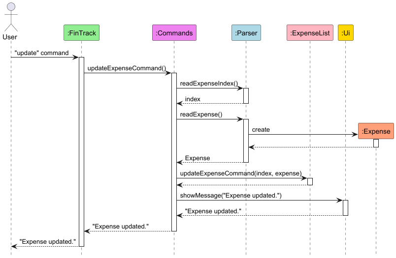
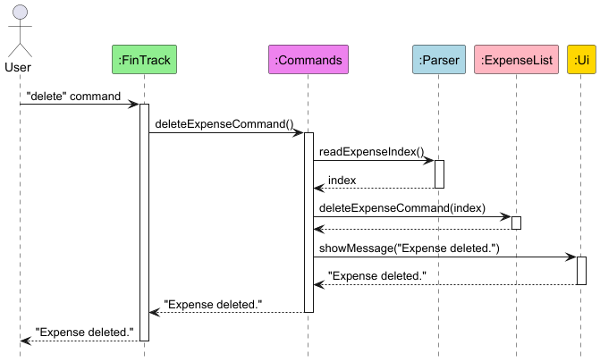

# Developer Guide

## Acknowledgements

[Java Standard Library](https://docs.oracle.com/javase/8/docs/api/): Utilized extensively for collections, date
handling, and file operations.

[ANSI Escape Codes](https://en.wikipedia.org/wiki/ANSI_escape_code): Adapted for colored console outputs in Ui.java.

[JUnit 5](https://junit.org/junit5/docs/current/user-guide/): Used for unit testing.

# Design & Implementation

## Architecture

The application follows a modular design:

* **FinTrack (Entry Point)**: Initializes components and manages the application loop.
* **Parser**: Handles user inputs and ensures validation.
* **Commands**: Manages mapping and execution of commands.
* **Expense & ExpenseList**: Data models representing expenses and collections of expenses.
* **Ui**: Provides a consistent user interface through console outputs.

<!-- @@author kaixiangg -->

### CRUD Operations Implementation

#### Overview

The CRUD (Create, Read, Update, Delete) operations
are central to FinTrack's expense management functionality.
They are implemented through the `Commands` class which acts as
a controller, coordinating between the user interface,
data parsing, and data storage components.
1. Create - `add` command
2. Read - `viewhistory` command
3. Update - `update` command
4. Delete - `delete` command

The CRUD operations follow a layered architecture and can be seen from the seqeunce diagrams below:

1. User Interface Layer (`Ui` class)
2. Control Layer (`Commands` class)
3. Logic Layer (`Parser` and `Categories` classes)
4. Data Layer (`ExpenseList` and `Storage` classes)

#### <u> Add Command Implementation </u>

The add command execution follows these steps:

1. User enters the "add" command
2. `FinTrack` forwards the request to `Commands`
3. `Commands` uses `Parser` to:
    - Read expense details (amount, category, description, date)
    - Validate the input data
    - Create a new `Expense` object
4. The new `Expense` is added to `ExpenseList`
5. A success message is shown through the `Ui` component
6. Confirmation is returned to the user

The category add command follows similar steps:

1. User enters the "category add" command
2. `FinTrack` forwards the request to `Commands`
3. `Commands` uses `Parser` to:
    - Read user's input (category name)
    - Validate the input data
    - Returns the input as a string
4. The new category is added to `Categories`
5. A success message is shown through the `Ui` component
6. Confirmation is returned to the user

#### <u> View History Implementation </u>

The view history command works as follows:

1. User enters the "history" command
2. `FinTrack` passes the request to `Commands`
3. `Commands` retrieves the full expense list from `ExpenseList`
4. The expense list is formatted and displayed through `Ui`
5. Display confirmation is returned through the chain

#### <u> Update Command Implementation </u>

The update command execution follows this sequence:
1. User enters the "update" command
2. `FinTrack` delegates to `Commands`
3. `Commands` uses `Parser` to:
    - Read and validate the expense index
    - Create a new `Expense` object with updated details
4. The new expense replaces the old one in `ExpenseList`
5. A success message is shown via `Ui`
6. Confirmation is returned to the user

#### <u> Delete Command Implementation </u>

The delete command execution involves the following steps:
1. User enters the "delete" command
2. `FinTrack` forwards the command to `Commands`
3. `Commands` uses `Parser` to read and validate the expense index
4. The validated index is used to delete the expense from `ExpenseList`
5. A success message is displayed through the `Ui` component
6. The confirmation message is propagated back to the user

The category del command follows similar steps:

1. User enters the "category del" command
2. `FinTrack` forwards the request to `Commands`
3. `Commands` uses `Parser` to:
    - Read user's input (category index)
    - Validate the input data
    - Returns the input as an int
4. The category is removed from the list of categories
5. A success message is shown through the `Ui` component
6. Confirmation is returned to the user

## Classes and Their Responsibilities

* **Commands**:
    * Maps user commands (`add`, `viewmonth`, `history`, `update`, `delete`, `budget`, `recurring`, `category add`,
      `category del`, `exit`, `help`) to their functionalities.
    * Contains methods to handle each user command.
* **Expense**:
    * Represents an expense with `amount` (in cents), `category`, `description`, and `date`.
* **ExpenseList**:
    * Manages lists of regular and recurring expenses.
    * Handles operations such as adding, deleting, updating expenses, and managing budgets.
* **Parser**:
    * Reads and validates user input from the command line.
    * Parses user-provided details into structured data types.
* **Ui**:
    * Facilitates user interaction by displaying prompts, messages, and errors in color-coded formats.
* **Categories**:
    * Manages the user's list of available categories to choose from when adding expenses.
* **Savings**:
    * Tracks the user's income, savings and if they meet their monthly savings goals.

<!-- @@author -->

## Product scope

### Target user profile

Young adults who are looking to manage their finances better and improve their discipline to continuously save their
income over time.

### Value proposition

Manage finances better by tracking expenses and income faster than a GUI driven application.

## User Stories

| Version | As a/an ...  | I can ...                                      | So that ...                                                | Priority     |
|---------|--------------|------------------------------------------------|------------------------------------------------------------|--------------|
| v1.0    | new user     | create custom categories                       | I can track expenses according to my lifestyle             | Must-Have    |
| v1.0    | regular user | manually log/add an expense                    | I can track my spending                                    | Must-Have    |
| v1.0    | regular user | set a monthly budget                           | I can track if I am overspending                           | Must-Have    |
| v1.0    | regular user | view a spending summary                        | I can understand my financial habits                       | Must-Have    |
| v1.0    | expert user  | search for past transactions                   | I can quickly find specific entries                        | Must-Have    |
| v1.0    | expert user  | set different budget limits for each category  | I can control my expenses more effectively                 | Must-Have    |
| v1.0    | new user     | access sample data in the app                  | I can explore how the app works before inputting real data | Nice-to-Have |
| v1.0    | regular user | track subscriptions and recurring payments     | I can avoid unwanted charges                               | Should-Have  |
| v2.0    | regular user | use currency conversion                        | I can track spending in different currencies               | Nice-to-Have |
| v2.0    | regular user | receive insights and tips on reducing expenses | I can optimize my spending                                 | Nice-to-Have |
| v2.0    | regular user | auto-categorize expenses based on past entries | I save time when logging transactions                      | Nice-to-Have |
| v2.0    | expert user  | track net worth over time                      | I can monitor my financial progress                        | Nice-to-Have |
| v2.0    | regular user | receive a monthly financial health report      | I can get insights into my financial behavior              | Nice-to-Have |
| v2.0    | regular user | set savings goals                              | I can track my progress toward financial targets           | Should-Have  |

## Non-Functional Requirements

This program should be able to work smoothly, with minimal lag in Windows 11, Ubuntu and MacOS.

## Glossary

* Expense – A financial transaction where money is spent.
* Recurring Expense – An expense that occurs automatically on a set schedule (e.g., monthly subscriptions).
* Budget – A financial limit set for expenses over a given period.
* Category – A label for grouping expenses (e.g., Food, Entertainment, Rent).
* Dashboard – The home screen of the application displaying an overview of financial data.
* User Role – Defines whether a user is a new user, regular user, or expert user, determining available features.

## Instructions for manual testing

1. **Launching the Application:**
    * Run `FinTrack.main()`.

2. **Adding an Expense:**
    * Type `add`, then input details in the format: `dollars, cents, category index, description, yyyy-MM-dd`

3. **Viewing Past Expenses:**
    * Type `viewhistory` to list current month expenses.

4. **Updating an Expense:**
    * Type `update`, follow prompts to specify the expense and new details.

5. **Deleting an Expense:**
    * Type `delete`, follow prompt to specify the expense index.

6. **Adding a Category**
    * Type `category add`, then input name of category.

7. **Deleting a Category**
    * Type `category del`, then input index of category.

