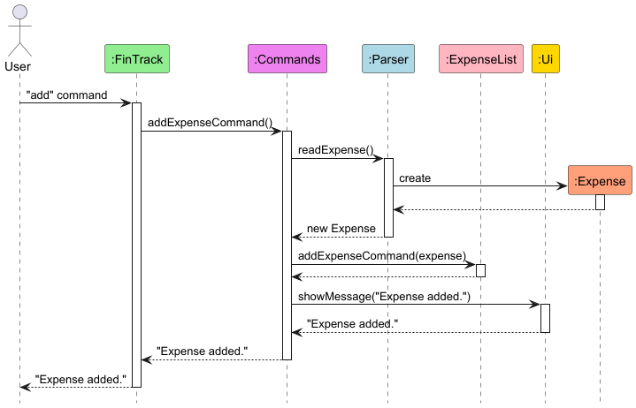
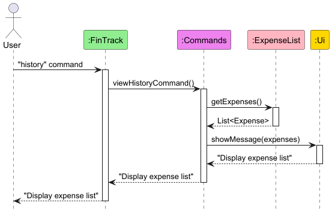

# Developer Guide

## Acknowledgements

[Java Standard Library](https://docs.oracle.com/javase/8/docs/api/): Utilized extensively for collections, date
handling, and file operations.

[ANSI Escape Codes](https://en.wikipedia.org/wiki/ANSI_escape_code): Adapted for colored console outputs in Ui.java.

[JUnit 5](https://junit.org/junit5/docs/current/user-guide/): Used for unit testing.

# Design & Implementation

## Architecture

The application follows a modular design with a command pattern implementation:

* **FinTrack (Entry Point)**: Initializes components and manages the application loop.
* **AllCommands**: Maps user commands to their respective command objects.
* **Command Interface**: Defines the contract for all command classes.
* **Command Classes**: Each command is implemented as a separate class.
* **Expense, RecurringExpense & ExpenseList**: Data models representing expenses and collections of expenses.
* **Parser**: Handles user inputs and ensures validation.
* **Ui**: Provides a consistent user interface through console outputs.
* **Storage**: Manages saving and loading of data to and from files.

The application follows a layered architecture:

1. User Interface Layer (`Ui` class)
2. Control Layer (Command classes)
3. Logic Layer (`Parser` and `Categories` classes)
4. Data Layer (`ExpenseList` and `Storage` classes)

### Command Pattern Implementation

The application uses the Command pattern to encapsulate each user command as a separate class. This design allows for:

1. **Extensibility**: New commands can be added by creating new command classes without modifying existing code.
2. **Single Responsibility**: Each command class is responsible for a single command.
3. **Encapsulation**: Command execution details are hidden from the main application.

The command pattern is implemented as follows:

1. **Command Interface**: Defines the contract for all commands with the `execute` method.
2. **Command Classes**: Implement the `Command` interface and provide specific functionality.
3. **AllCommands**: Maps command strings to their respective command objects and executes them.

### CRUD Operations Implementation

The CRUD (Create, Read, Update, Delete) operations are central to FinTrack's expense management functionality.
They are implemented through separate command classes that act as controllers, coordinating between the user interface,
data parsing, and data storage components.

1. Create - `AddExpenseCommand` class
2. Read - `ViewHistoryCommand` class
3. Update - `UpdateExpenseCommand` class
4. Delete - `DeleteExpenseCommand` class

#### <u> Add Command Implementation </u>

The add command execution follows these steps:

1. User enters the "add" command
2. `FinTrack` forwards the request to `AllCommands`
3. `AllCommands` creates an `AddExpenseCommand` object
4. `AddExpenseCommand` uses `Parser` to:
    - Read expense details (amount, category, description, date)
    - Validate the input data
    - Create a new `Expense` object
5. The new `Expense` is added to `ExpenseList`
6. A success message is shown through the `Ui` component
7. Confirmation is returned to the user

**Note:** The system enforces a maximum expense amount of $1,000,000.00 (one million dollars). If a user attempts to enter an amount exceeding this limit, the system will throw a `FinTrackException` with an appropriate error message.

The category add command follows similar steps:

1. User enters the "category add" command
2. `FinTrack` forwards the request to `AllCommands`
3. `AllCommands` creates an `AddCategoryCommand` object
4. `AddCategoryCommand` uses `Parser` to:
    - Read user's input (category name)
    - Validate the input data
    - Returns the input as a String[ ]
5. The new category is added to `Categories`
6. A success message is shown through the `Ui` component
7. Confirmation is returned to the user

The add recurring expense command execution follows steps similar to add expense:

1. User enters the "recurring" command
2. `FinTrack` forwards the request to `AllCommands`
3. `AllCommands` creates an `AddRecurringExpenseCommand` object
4. `AddRecurringExpenseCommand` uses `Parser` to:
    - Read recurring expense details (amount, category, description, frequency)
    - Validate the input data
    - Create a new `RecurringExpense` object
5. The new `RecurringExpense` is added to `RecurringExpenses`
6. A success message is shown through the `Ui` component
7. Confirmation is returned to the user

**Note:** Similar to add command, the system enforces a maximum expense amount of $1,000,000.00 (one million dollars). If a user attempts to enter an amount exceeding this limit, the system will throw a `FinTrackException` with an appropriate error message.

#### <u> View History Implementation </u>

The view history command works as follows:

1. User enters the "history" command
2. `FinTrack` passes the request to `AllCommands`
3. `AllCommands` creates a `ViewHistoryCommand` object
4. `ViewHistoryCommand` retrieves the full expense list from `ExpenseList`
5. The expense list is formatted and displayed through `Ui`
6. Display confirmation is returned through the chain

The view recurring command operates similarly to the view history command and is as follows:

1. User enters the "view recurring" command
2. `FinTrack` passes the request to `AllCommands`
3. `AllCommands` creates a `ViewRecurringExpenseCommand` object
4. `ViewRecurringExpenseCommand` gets the recurring expense list from `ExpenseList` by calling `getRecurringExpenses()`
5. If the list is not empty, the recurring expense list is then shown to the user through `Ui`, else a message about the recurring expense list being empty is shown via `Ui`

#### <u> Update Command Implementation </u>

The update command execution follows this sequence:
1. User enters the "update" command
2. `FinTrack` delegates to `AllCommands`
3. `AllCommands` creates an `UpdateExpenseCommand` object
4. `UpdateExpenseCommand` uses `Parser` to:
    - Read and validate the expense index
    - Create a new `Expense` object with updated details
5. The new expense replaces the old one in `ExpenseList` using `updateExpense(index, expense)`
6. A success message is shown via `Ui`
7. Confirmation is returned to the user

**Note:** Similar to the add command, the update command also enforces a maximum expense amount of $1,000,000.00 (one million dollars). If a user attempts to update an expense with an amount exceeding this limit, the system will throw a `FinTrackException` with an appropriate error message.

The update recurring command execution is similar to the update command and follows this sequence:
1. User enters the "recurring" command
2. `FinTrack` forwards the request to `AllCommands`
3. `AllCommands` creates an `UpdateRecurringExpenseCommand` object
4. `UpdateRecurringExpenseCommand` uses `Parser` to:
    - Read recurring expense details (amount, category, description, frequency)
    - Validate the input data
    - Create a new `RecurringExpense` object with updated recurring expense details
5. The new `RecurringExpense` replaces the old one in `RecurringExpenses` via `updateRecurringExpense(index,recurringExpense)`
6. A success message is shown through the `Ui` component

**Note:** Same as the update command and recurring command, there is a maximum expense amount of $1,000,000, and inputting a value larger thaan that will throw a `FinTrackException` with an appropriate error message.

#### <u> Delete Command Implementation </u>

The delete command execution involves the following steps:
1. User enters the "delete" command
2. `FinTrack` forwards the command to `AllCommands`
3. `AllCommands` creates a `DeleteExpenseCommand` object
4. `DeleteExpenseCommand` uses `Parser` to read and validate the expense index
5. The validated index is used to delete the expense from `ExpenseList`
6. A success message is displayed through the `Ui` component
7. The confirmation message is propagated back to the user

The category del command follows similar steps:

1. User enters the "delete recurring" command
2. `FinTrack` forwards the request to `AllCommands`
3. `AllCommands` creates a `DeleteRecurringExpenseCommand` object
4. `DeleteRecurringExpenseCommand` uses `Parser` to:
    - Read user's input (recurring expense index)
    - Validate the input data
    - Returns the input as an Integer[ ]
5. The category is removed from the list of categories
6. A success message is shown through the `Ui` component
7. Confirmation is returned to the user

The delete recurring command follows a similar sequence to delete command
and follows these steps:
1. User enters the "delete" command
2. `FinTrack` forwards the command to `AllCommands`
3. `AllCommands` creates a `DeleteExpenseCommand` object
4. `DeleteExpenseCommand` uses `Parser` to read and validate the recurring expense index
5. `deleteRecurringExpense(index)` is called and a recurring expense is deleted from `recurringExpenses`
6. A success message is displayed through the `Ui` component
7. The confirmation message is displayed to the user

### Additional Command Implementations

#### <u> Clear History Command Implementation </u>

The clear history command works as follows:
1. User enters the "clear" command
2. `FinTrack` delegates to `AllCommands`
3. `AllCommands` creates a `ClearHistoryCommand` object
4. `ClearHistoryCommand` displays a warning message and asks for confirmation
5. If the user confirms with "yes", the expense list is cleared
6. The empty list is saved to storage
7. A success message is shown via `Ui`

#### <u> Update Income Implementation </u>

The update income command works as follows:
1. User enters the "update icome" command
2. `FinTrack` delegates to `AllCommands`
3. `AllCommands` creates a `UpdateIncomeCommand` object
4. `UpdateIncomeCommand` displays a previous income and asks for the new income
5. If the user new income, the income is updated
6. The income is saved to storage
7. A success message is shown via `Ui`

#### <u> Update Savings Goals Implementation </u>

The update savings goals command works as follows:
1. User enters the "update savings goals" command
2. `FinTrack` delegates to `AllCommands`
3. `AllCommands` creates a `UpdateSavingsGoalsCommand` object
4. `UpdateSavingsGoalsCommand` displays a previous income and asks for the new income
5. If the user new savings goals, the savings goals is updated
6. The savings goals is saved to storage
7. A success message is shown via `Ui`

#### <u> Tips Implementation </u>

The tips command works as follows:
1. User enters the "tips" command
2. `FinTrack` delegates to `AllCommands`
3. `AllCommands` creates a `TipsCommand` object
4. `TipsCommand` displays a rnadomly generated tip
5. 

#### <u> Export Command Implementation </u>

The export command works as follows:
1. User enters the "export" command
2. `FinTrack` delegates to `AllCommands`
3. `AllCommands` creates an `ExportCommand` object
4. `ExportCommand` creates an "exports" directory if it doesn't exist
5. A CSV file is created with a timestamp in the filename
6. The expense list is written to the CSV file
7. A success message is shown via `Ui`

#### <u> Help Command Implementation </u>

The help command works as follows:
1. User enters the "help" command
2. `FinTrack` delegates to `AllCommands`
3. `AllCommands` creates a `HelpCommand` object
4. `HelpCommand` displays detailed usage instructions for all commands
5. The instructions include examples and step-by-step guidance

#### <u> Exit Command Implementation </u>

The exit command works as follows:
1. User enters the "exit" command
2. `FinTrack` delegates to `AllCommands`
3. `AllCommands` creates an `ExitCommand` object
4. `ExitCommand` saves the expense list to storage
5. A farewell message is displayed
6. The application exits with `System.exit(0)`

## Classes and Their Responsibilities

* **FinTrack**:
    * Main entry point for the application.
    * Initializes components and manages the application loop.
    * Reads user input and delegates to `AllCommands` for execution.
* **AllCommands**:
    * Maps command strings to their respective command objects.
    * Executes commands based on user input.
    * Handles invalid commands by displaying error messages.
* **Command**:
    * Interface that defines the contract for all command classes.
    * Contains the `execute` method that all command classes must implement.
* **Command Classes**:
    * Each command is implemented as a separate class (e.g., `AddExpenseCommand`, `DeleteExpenseCommand`).
    * Each command class handles a specific user command and its associated functionality.
* **Expense**:
    * Represents an expense with `amount` (in cents), `category`, `description`, and `date`.
* **RecurringExpense**:
    * A subclass of Expense class, extends the base Expense class to model expenses that repeat at regular intervals (weekly, monthly, yearly).
    * Has additional parameters `frequency` (Weekly, Monthly, Yearly) to set the frequency of the recurring expense
    , `startDate` representing the date of the first recurring expense, and `lastProcesseddate` which shows the latest date a recurring expense is added into the `expenseList`.
* **ExpenseList**:
    * Manages lists of regular and recurring expenses.
    * Handles operations such as adding, deleting, updating expenses, and managing budgets.
    * The `updateExpense` method takes a 1-based index and converts it to a 0-based index for ArrayList operations.
    * Operates `addAllRecurringExpenses`, which calls upon `addRecurringExpenses(recurringExpense)`, where `addRecurringExpenses(recurringExpense)` adds recurring expense (of expense type) into `expenseList` by comparing the `lastProcesseddate` and `currentDate` and seeing the number of occurences between that time period based on the given frequency, for all the recurring expenses
* **Parser**:
    * Reads and validates user input from the command line.
    * Parses user-provided details into structured data types.
    * Provides methods for reading different types of input (integers, dates, etc.).
* **Ui**:
    * Facilitates user interaction by displaying prompts, messages, and errors in color-coded formats.
    * Provides methods for displaying formatted output.
* **Categories**:
    * Manages the user's list of available categories to choose from when adding expenses.
* **Savings**:
    * Tracks the user's income, savings and if they meet their monthly savings goals.
* **Storage**:
    * Manages saving and loading of information in the application. Reads and writes data to and from text files.

### Class Diagram

Below is the class diagram showing the basic class interactions in FinTrack:

### Class diagrams of key classes

## Product scope

### Target user profile

Young adults who are looking to manage their finances better and improve their discipline to continuously save their
income over time.

### Value proposition

Manage finances better by tracking expenses and income faster than a GUI driven application.

## User Stories

| Version | As a/an ...  | I can ...                                      | So that ...                                                | Priority     |
|---------|--------------|------------------------------------------------|------------------------------------------------------------|--------------|
| v1.0    | new user     | create custom categories                       | I can track expenses according to my lifestyle             | Must-Have    |
| v1.0    | regular user | manually log/add an expense                    | I can track my spending                                    | Must-Have    |
| v1.0    | regular user | set a monthly budget                           | I can track if I am overspending                           | Must-Have    |
| v1.0    | regular user | view a spending summary                        | I can understand my financial habits                       | Must-Have    |
| v1.0    | expert user  | search for past transactions                   | I can quickly find specific entries                        | Must-Have    |
| v1.0    | expert user  | set different budget limits for each category  | I can control my expenses more effectively                 | Must-Have    |
| v1.0    | new user     | access sample data in the app                  | I can explore how the app works before inputting real data | Nice-to-Have |
| v1.0    | regular user | track subscriptions and recurring payments     | I can avoid unwanted charges                               | Should-Have  |
| v2.0    | regular user | use currency conversion                        | I can track spending in different currencies               | Nice-to-Have |
| v2.0    | regular user | receive insights and tips on reducing expenses | I can optimize my spending                                 | Nice-to-Have |
| v2.0    | regular user | auto-categorize expenses based on past entries | I save time when logging transactions                      | Nice-to-Have |
| v2.0    | expert user  | track net worth over time                      | I can monitor my financial progress                        | Nice-to-Have |
| v2.0    | regular user | receive a monthly financial health report      | I can get insights into my financial behavior              | Nice-to-Have |
| v2.0    | regular user | set savings goals                              | I can track my progress toward financial targets           | Should-Have  |

## Non-Functional Requirements

This program should be able to work smoothly, with minimal lag in Windows 11, Ubuntu and MacOS.

## Glossary

* Expense – A financial transaction where money is spent.
* Recurring Expense – An expense that occurs automatically on a set schedule (e.g., monthly subscriptions).
* Budget – A financial limit set for expenses over a given period.
* Category – A label for grouping expenses (e.g., Food, Entertainment, Rent).
* Dashboard – The home screen of the application displaying an overview of financial data.
* User Role – Defines whether a user is a new user, regular user, or expert user, determining available features.

## Instructions for manual testing

1. **Launching the Application:**
    * Run `FinTrack.main()`.

2. **Adding an Expense:**
    * Type `add`, then input details in the format: `dollars, cents, category index, description, yyyy-MM-dd`

3. **Viewing Past Expenses:**
    * Type `history` to list all expenses.

4. **Updating an Expense:**
    * Type `update`, follow prompts to specify the expense and new details.

5. **Deleting an Expense:**
    * Type `delete`, follow prompt to specify the expense index.
6. **Adding a recurring expense**
    * Type `recurring`, then input details in the format:`dollars, cents, category index, description, frequency`
7. **Updating a recurring expense**
    * Type `update recurring`,  follow prompt to specify the recurring expense index, then update recurring expense using the same format when adding recurring expense
8. **Viewing recurring expenses**
    * Type `view recurring` to see all recurring expenses
9. **Deleting a recurring expense**
    * Type `delete recurring`, follow prompt to specifiy recurring expense index. 
10. **Adding a Category**
    * Type `category add`, then input name of category/categories.
11. **Deleting a Category**
    * Type `category del`, then input index/indexes of category.

12. **Clearing History**
    * Type `clear`, then confirm with "yes" to clear all expenses.

13. **Exporting Expenses**
    * Type `export` to create a CSV file of all expenses in the "exports" folder.

14. **Getting Help**
    * Type `help` to view detailed usage instructions.

15. **Exiting the Application**
    * Type `exit` to save data and close the application.

